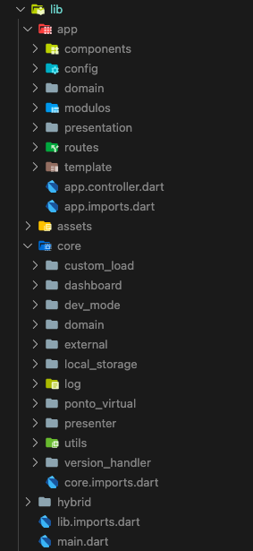

# Projeto PTEM 2.0

Projeto onde estão sendo desenvolvidos os recursos do zero, visando melhorias. Esse projeto é importado dentro do PTEM, como se fosse um package. 

## Estrutura de pastas

### Diretório APP/

#### Diretório MODULOS/

#### Diretório PRESENTATION/

### Diretório CORE/ 

Diretório onde se encontram elementos de âmbito global, e que são utilizados por mais de um modulo, que podem ser vistos como um tipo de package interno. Seguem alguns exemplos para ficar mais fácil de compreender: 
  **CustomLoad/** - Reúne classes referentes a um widget de loading, exibido na forma de um modal. Esse widget é disparado em diferentes telas/modulos. 
  **LocalStorage/** - Reúne classes relacionados a persistência local, como por exemplo classes para trabalhar com SharedPreferences. 

